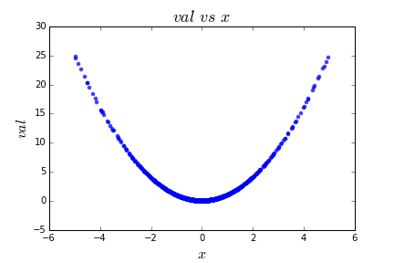
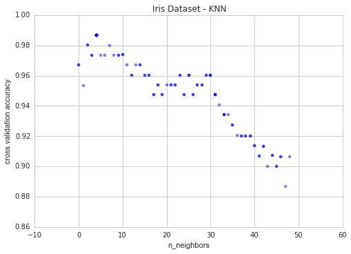

# Parameter Tuning in Python Using Hyperopt
This post will cover a few things needed to quickly implement a fast, principled method for machine learning model parameter tuning. There are two common methods of parameter tuning: grid search and random search. Each have their pros and cons. Grid search is slow but effective at searching the whole search space, while random search is fast, but could miss important points in the search space. Luckily, a third option exists: bayesian optimization. In this post, we will focus on one implementation of bayesian optimization, a Python module called `hyperopt`. 

Using bayesian optimization for parameter tuning allows us to obtain the best parameters for a given model, e.g., logistic regression. This also allows us to perform optimal model selection. Typically, a machine learning engineer or data scientist will perform some form of manual parameter tuning (grid search or random search) for a few models--like decision tree, support vector machine, and k nearest neighbors--then compare the accuracy scores and select the best one for use. This method has the possiblity of comparing sub-optimal models. Maybe the data scientist found the optimal parameters for the decision tree, but missed the optimal parameters for SVM. This means their model comparison was flawed. K nearest neighbors may beat SVM every time if the SVM parameters are poorly tuned. Bayesian optimization allow the data scientist to find the *best* parameters for all models, and therefore compare the best models. This results in better model selection, because you are comparing the *best* k nearest neighbors to the *best* decision tree. Only in this way can you do model selection with high confidence, assured that the actual best model is selected and used. 

Topics covered are in this post are 
1. objective functions
2. search spaces
3. storing evaluation trials
4. visualization
5. full example on a classic dataset: Iris

To use the code below, you must install `hyperopt` and `pymongo`. 

# 1. Objective Functions - A Motivating Example
Suppose you have a function defined over some range, and you want to minimize it--that is, you want to find the input value that result in the lowest output value. 
The trivial example below finds the value of `x` that minimizes a linear function `y(x) = x`. 
```
from hyperopt import fmin, tpe, hp
best = fmin(
    fn=lambda x: x,
    space=hp.uniform('x', 0, 1),
    algo=tpe.suggest,
    max_evals=100)
print best
```
Let's break this down. 

The function `fmin` first takes a function to minimize, denoted `fn`, which we here specify with an anonymous function `lambda x: x`. This function could be any valid value-returning function, such as mean absolute error in regression.  

The next parameter specifies the search space, and in this example it is the continuous range of numbers between 0 and 1, specified by `hp.uniform('x', 0, 1)`. `hp.uniform` is a built-in `hyperopt` function that takes three parameters: the name, `x`, and the lower and upper bound of the range, `0` and `1`. 

The parameter `algo` takes a search algorithm, in this case `tpe` which stands for *tree of Parzen estimators*. This topic is beyond the scope of this blog post, but the mathochistic reader may peruse [this](http://arxiv.org/abs/1209.5111) for details. `algo` can also be set to `hyperopt.random`, but we do not cover that here as it is widely known search strategy. However, in a future post, we can 

Finally, we specify the maximum number of evaluations `max_evals` the `fmin` function will perform. 
`fmin` returns a python dictionary of values. 

An example of the output for the function above is `{'x': 0.000269455723739237}`. 

Here is the plot of the function. The red dot is the point we are trying to find. 


## 1.2 More Complicated Examples
Here is a more complicated objective function: `lambda x: (x-1)**2`. This time we are trying to minimize a quadratic equation `y(x) = (x-1)**2`. So we alter the search space to include what we know to be the optimal value (`x=1`) plus some sub-optimal ranges on either side: `hp.uniform('x', -2, 2)`. Now we have 
```
best = fmin(
	fn=lambda x: (x-1)**2,
	space=hp.uniform('x', -2, 2),
	algo=tpe.suggest,
	max_evals=100)
print best
```
The output should look something like this:
```
{'x': 0.997369045274755}
```

Here is the plot. 


Instead of minimizing an objective function, maybe we want to maximize it. To to this we need only return the negative of the function. For example, we could have a function `y(x) = -(x**2)`:


How could we go about solving this? We just take the objective function `lambda x: -(x**2)` and return the negative, giving `lambda x: -1*-(x**2)` or just `lambda x: (x**2)`. 

Here is one similar to example 1, but instead of minimizing, we are trying to maximize. 


Here is a function with many (infinitely many given an infinite range) local minima, which we are also trying to maximize:


# 2. Search Spaces
`hyperopt` includes a few handy functions to specify ranges for input parameters. We have already seen `hp.uniform`. Initially, these are stochastic search spaces, but as `hyperopt` learns more (as it gets more feedback from the objective function), it adapts and samples different parts of the initial search space that it thinks will give it the most meaningful feedback. The following will be used in this post: 
1. `hp.choice(label, options)` where `options` should be a python list or tuple
2. `hp.normal(label, mu, sigma)` where `mu` and `sigma` are the mean and standard deviation, respectively. 
3. `hp.uniform(label, low, high)` where `low` and `high` are the lower and upper bounds on the range.

Others are available, such as `hp.normal`, `hp.lognormal`, `hp.quniform`, but we will not use them here. 

To see some draws from the search space, we should import another function, and define the search space. 
```
import hyperopt.pyll.stochastic

space = {
	'x': hp.uniform('x', 0, 1),
	'y': hp.normal('y', 0, 1),
	'name': hp.choice('name', ['alice', 'bob']),
}

print hyperopt.pyll.stochastic.sample(space)
```
An example output is:
```
{'y': -1.4012610048810574, 'x': 0.7258615424906184, 'name': 'alice'}
```
Try running this a few times and to see the different samples. 

# 3. Capturing Info with Trials
It would be nice to see exactly what is happening inside the `hyperopt` black box. The `Trials` object allows us to do just that. We need only import a few more items. 
```
from hyperopt import fmin, tpe, hp, STATUS_OK, Trials

fspace = {
	'x': hp.uniform('x', -5, 5)
}

def f(params):
	x = params['x']
	val = x**2
	return {'loss': val, 'status': STATUS_OK}

trials = Trials()
	best = fmin(fn=f, space=fspace, algo=tpe.suggest, max_evals=50, trials=trials)

print 'best:', best

print 'trials:'
for trial in trials.trials[:2]:
	print trial
```
The `STATUS_OK` and `Trials` imports are new. The `Trials` object allows us to store info at each time step they are stored. We can then print them out and see what is the evaluations of the function were for a given parameter at a given time step. Here is an example output of the code above:
```
best: {'x': 0.014420181637303776}
trials:
{'refresh_time': None, 'book_time': None, 'misc': {'tid': 0, 'idxs': {'x': [0]}, 'cmd': ('domain_attachment', 'FMinIter_Domain'), 'vals': {'x': [1.9646918559786162]}, 'workdir': None}, 'state': 2, 'tid': 0, 'exp_key': None, 'version': 0, 'result': {'status': 'ok', 'loss': 3.8600140889486996}, 'owner': None, 'spec': None}
{'refresh_time': None, 'book_time': None, 'misc': {'tid': 1, 'idxs': {'x': [1]}, 'cmd': ('domain_attachment', 'FMinIter_Domain'), 'vals': {'x': [-3.9393509404526728]}, 'workdir': None}, 'state': 2, 'tid': 1, 'exp_key': None, 'version': 0, 'result': {'status': 'ok', 'loss': 15.518485832045357}, 'owner': None, 'spec': None}
```
The trials object stores data as a `BSON` object, which works just like a `JSON` object. `BSON` is from the `pymongo` module. We will not discuss the details here, but there are advanced options for `hyperopt` that require distributed computing using `MongoDB`--hence the `pymongo` import. 

Back to the output above. The `'tid'` is the time id, that is, the time step, which goes from `0` to `max_evals-1`. It increases by one each iteration. `'x'` is in the `'vals'` key, which is where your parameters are stored for each iteration. `'loss'` is in the `'result'` key, which gives us the value for our objective function at that iteration. 

Let's look at this in another way. 

# 4. Visualization
We'll go over two types of visualizations here: val vs. time, and loss vs. val. First, val vs. time. Below is the code and sample output for plotting the `trials.trials` data described above. 
```
f, ax = plt.subplots(1)
xs = [t['tid'] for t in trials.trials]
ys = [t['misc']['vals']['x'] for t in trials.trials]
ax.set_xlim(xs[0]-10, xs[-1]+10)
ax.scatter(xs, ys, s=20, linewidth=0.01, alpha=0.75)
ax.set_title('$x$ $vs$ $t$ ', fontsize=18)
ax.set_xlabel('$t$', fontsize=16)
ax.set_ylabel('$x$', fontsize=16)
```
The output should look like this, assuming we change `max_evals` to 1000. 


We can see that initially the algorithm picks values from the whole range equally (uniformly), but as time goes on and more is learned about the parameter's effect on the objective function, the algorithm focuses more and more on areas in which it thinks it will gain the most--the range close to zero. It still explores the whole solution space, but less frequently. 
Now let's look at the plot of loss vs. val. 
```
f, ax = plt.subplots(1)
xs = [t['misc']['vals']['x'] for t in trials.trials]
ys = [t['result']['loss'] for t in trials.trials]
ax.scatter(xs, ys, s=20, linewidth=0.01, alpha=0.75)
ax.set_title('$val$ $vs$ $x$ ', fontsize=18)
ax.set_xlabel('$x$', fontsize=16)
ax.set_ylabel('$val$', fontsize=16)
```


This gives us what we expect, since the function `y(x) = x**2` is deterministic. 

To wrap up, let's try a more complicated example, with more randomness and more parameters.  

# 5. The Iris Dataset

In this section, we'll walk through 3 full examples of using `hyperopt` for parameter tuning on a classic dataset, Iris. We will cover K-Nearest Neighbors (KNN), Support Vector Machines (SVM), Decision Trees, and Random Forests. Note that since are trying to maximize the cross-validation accuracy (`acc` in the code below), we must negate this value for `hyperopt`, since `hyperopt` only knows how to minimize a function. Minimizing a function `f` is the same as maximizing the negative of `f`. 

For this task, we'll use the classis Iris data set, and do some supervised machine learning. There are 4 input features, and three output classes. The data are labeled as belonging to class 0, 1, or 2, which map to different kinds of Iris flower. The input has 4 columns: sepal length, sepal width, petal length, and pedal width. Units of the input are centimeters. We will use these 4 features to learn a model that predicts one of three output classes. Since the data is provided by sklearn, it has a nice DESCR attribute that provides details on the data set. Try 
```
print iris.feature_names # input names
print iris.target_names # output names
print iris.DESCR # everything else
```
for more details. 

Let's get to know the data a little better through visualization of the features and classes, using the code below. Don't forget to `pip install seaborn` if you have not already. 
```
import seaborn as sns
sns.set(style="whitegrid", palette="husl")

iris = sns.load_dataset("iris")
print iris.head()

iris = pd.melt(iris, "species", var_name="measurement")
print iris.head()

f, ax = plt.subplots(1, figsize=(15,10))
sns.stripplot(x="measurement", y="value", hue="species", data=iris, jitter=True, edgecolor="white", ax=ax)
```
Here is the plot:


### 5.1 K-Nearest Neighbors
The code below incorporates everything we have covered. 

```
from sklearn import datasets
iris = datasets.load_iris()
X = iris.data
y = iris.target

def hyperopt_train_test(params):
clf = KNeighborsClassifier(**params)
return cross_val_score(clf, X, y).mean()

space4knn = {
	'n_neighbors': hp.choice('n_neighbors', range(1,100))
}

def f(params):
	acc = hyperopt_train_test(params)
	return {'loss': -acc, 'status': STATUS_OK}

trials = Trials()
best = fmin(f, space4knn, algo=tpe.suggest, max_evals=100, trials=trials)
print 'best:'
print best
```

Now let's see the plot of the output. The y axis is the cross validation score, and the x axis is the `k` value in k-nearest-neighbors. Here is the code and it's image: 

```
f, ax = plt.subplots(1)#, figsize=(10,10))
xs = [t['misc']['vals']['n'] for t in trials.trials]
ys = [-t['result']['loss'] for t in trials.trials]
ax.scatter(xs, ys, s=20, linewidth=0.01, alpha=0.5)
ax.set_title('Iris Dataset - KNN', fontsize=18)
ax.set_xlabel('n_neighbors', fontsize=12)
ax.set_ylabel('cross validation accuracy', fontsize=12)
```


After `k` is greater than 63, the accuracy drops precipitously. This is due to the number of each class in the dataset. There are only 50 instances of each of the three classes. So let's drill down by limiting the values of `'n_neighbors` to smaller values. 
```
from sklearn import datasets
iris = datasets.load_iris()
X = iris.data
y = iris.target

def hyperopt_train_test(params):
	clf = KNeighborsClassifier(**params)
	return cross_val_score(clf, X, y).mean()

space4knn = {
	'n_neighbors': hp.choice('n_neighbors', range(1,50))
}

def f(params):
	acc = hyperopt_train_test(params)
	return {'loss': -acc, 'status': STATUS_OK}

trials = Trials()
best = fmin(f, space4knn, algo=tpe.suggest, max_evals=100, trials=trials)
print 'best:'
print best
```
Here is what we get when we run the same code for visualization:



Now we can see clearly that there is a best value for `k`, at `k` = 4. 

The model above does not do any preprocessing. So let's normalize and scale our features and see if that helps. Use this code:
```
# now with scaling as an option
from sklearn import datasets
iris = datasets.load_iris()
X = iris.data
y = iris.target

def hyperopt_train_test(params):
	X_ = X[:]

	if 'normalize' in params:
		if params['normalize'] == 1:
			X_ = normalize(X_)
			del params['normalize']

	if 'scale' in params:
		if params['scale'] == 1:
			X_ = scale(X_)
			del params['scale']

	clf = KNeighborsClassifier(**params)
	return cross_val_score(clf, X_, y).mean()

space4knn = {
	'n_neighbors': hp.choice('n_neighbors', range(1,50)),
	'scale': hp.choice('scale', [0, 1]),
	'normalize': hp.choice('normalize', [0, 1])
}

def f(params):
	acc = hyperopt_train_test(params)
	return {'loss': -acc, 'status': STATUS_OK}

trials = Trials()
best = fmin(f, space4knn, algo=tpe.suggest, max_evals=100, trials=trials)
print 'best:'
print best
```
And plot the parameters like this:
```
parameters = ['n_neighbors', 'scale', 'normalize']
cols = len(parameters)
f, axes = plt.subplots(nrows=1, ncols=cols, figsize=(15,5))
cmap = plt.cm.jet
for i, val in enumerate(parameters):
	xs = np.array([t['misc']['vals'][val] for t in trials.trials]).ravel()
	ys = [-t['result']['loss'] for t in trials.trials]
	xs, ys = zip(\*sorted(zip(xs, ys)))
	ys = np.array(ys)
	axes[i].scatter(xs, ys, s=20, linewidth=0.01, alpha=0.75, c=cmap(float(i)/len(parameters)))
	axes[i].set_title(val)
```


We see that scaling and/or normalizing the data does not improve predictive accuracy. The best value of `k` remains 4, which results in 98.6 % accuracy. 

So this is great for parameter tuning a simple model, KNN. Let's see what we can do with Support Vector Machines (SVM). 

### 5.2 Support Vector Machines (SVM)

Since this is a classification task, we'll use `sklearn`'s `SVC` class. Here is the code:
```
iris = datasets.load_iris()
X = iris.data
y = iris.target

def hyperopt_train_test(params):
	X_ = X[:]

	if 'normalize' in params:
		if params['normalize'] == 1:
			X_ = normalize(X_)
			del params['normalize']

	if 'scale' in params:
		if params['scale'] == 1:
			X_ = scale(X_)
			del params['scale']

	clf = SVC(**params)
	return cross_val_score(clf, X_, y).mean()

space4svm = {
	'C': hp.uniform('C', 0, 20),
	'kernel': hp.choice('kernel', ['linear', 'sigmoid', 'poly', 'rbf']),
	'gamma': hp.uniform('gamma', 0, 20),
	'scale': hp.choice('scale', [0, 1]),
	'normalize': hp.choice('normalize', [0, 1])
}

def f(params):
	acc = hyperopt_train_test(params)
	return {'loss': -acc, 'status': STATUS_OK}

trials = Trials()
best = fmin(f, space4svm, algo=tpe.suggest, max_evals=100, trials=trials)
print 'best:'
print best

parameters = ['C', 'kernel', 'gamma', 'scale', 'normalize']
cols = len(parameters)
f, axes = plt.subplots(nrows=1, ncols=cols, figsize=(20,5))
cmap = plt.cm.jet
for i, val in enumerate(parameters):
	xs = np.array([t['misc']['vals'][val] for t in trials.trials]).ravel()
	ys = [-t['result']['loss'] for t in trials.trials]
	xs, ys = zip(\*sorted(zip(xs, ys)))
	axes[i].scatter(xs, ys, s=20, linewidth=0.01, alpha=0.25, c=cmap(float(i)/len(parameters)))
	axes[i].set_title(val)
	axes[i].set_ylim([0.9, 1.0])
```
Here is what we get:


Again, scaling and normalizing do not help. The first choice of kernel funcion is the best (`linear`), the best `C` value is `1.4168540399911616`, and the best `gamma` is `15.04230279483486`. This set of parameters results in 99.3 % classification accuracy. 

### 5.3 Decision Trees
We will only attempt to optimize on a few parameters of decision trees. Here is the code. 
```
iris = datasets.load_iris()
X_original = iris.data
y_original = iris.target

def hyperopt_train_test(params):
	X_ = X[:]
	if 'normalize' in params:
		if params['normalize'] == 1:
			X_ = normalize(X_)
			del params['normalize']

	if 'scale' in params:
		if params['scale'] == 1:
			X_ = scale(X_)
			del params['scale']
	clf = DecisionTreeClassifier(**params)
	return cross_val_score(clf, X, y).mean()

space4dt = {
	'max_depth': hp.choice('max_depth', range(1,20)),
	'max_features': hp.choice('max_features', range(1,5)),
	'criterion': hp.choice('criterion', ["gini", "entropy"]),
	'scale': hp.choice('scale', [0, 1]),
	'normalize': hp.choice('normalize', [0, 1])
}

def f(params):
acc = hyperopt_train_test(params)
return {'loss': -acc, 'status': STATUS_OK}

trials = Trials()
best = fmin(f, space4dt, algo=tpe.suggest, max_evals=300, trials=trials)
print 'best:'
print best
```
The output is `{'max_features': 1, 'normalize': 0, 'scale': 0, 'criterion': 0, 'max_depth': 17}`, which gives 97.3 % accuracy. 

Here are the plots. We can see that there is little difference in performance with different values of  `scale`, `normalize`, and `criterion`.  

```
parameters = ['max_depth', 'max_features', 'criterion', 'scale', 'normalize'] # decision tree
cols = len(parameters)
f, axes = plt.subplots(nrows=1, ncols=cols, figsize=(20,5))
cmap = plt.cm.jet
for i, val in enumerate(parameters):
	xs = np.array([t['misc']['vals'][val] for t in trials.trials]).ravel()
	ys = [-t['result']['loss'] for t in trials.trials]
	xs, ys = zip(\*sorted(zip(xs, ys)))
	ys = np.array(ys)
	axes[i].scatter(xs, ys, s=20, linewidth=0.01, alpha=0.5, c=cmap(float(i)/len(parameters)))
	axes[i].set_title(val)
	#axes[i].set_ylim([0.9,1.0])
```


### 5.4 Random Forests
Let's see what's happending with an ensemble classifier, Random Forest, which is just a collection of decision trees trained on different even-sized partitions of the data, each of which votes on an output class, with the majority class being chosen as the prediction. 
```
iris = datasets.load_iris()
X_original = iris.data
y_original = iris.target

def hyperopt_train_test(params):
	X_ = X[:]
	if 'normalize' in params:
		if params['normalize'] == 1:
			X_ = normalize(X_)
			del params['normalize']

	if 'scale' in params:
		if params['scale'] == 1:
			X_ = scale(X_)
			del params['scale']
	clf = RandomForestClassifier(**params)
	return cross_val_score(clf, X, y).mean()

space4rf = {
	'max_depth': hp.choice('max_depth', range(1,20)),
	'max_features': hp.choice('max_features', range(1,5)),
	'n_estimators': hp.choice('n_estimators', range(1,20)),
	'criterion': hp.choice('criterion', ["gini", "entropy"]),
	'scale': hp.choice('scale', [0, 1]),
	'normalize': hp.choice('normalize', [0, 1])
}

best = 0
def f(params):
	global best
	acc = hyperopt_train_test(params)
	if acc > best:
	best = acc
	print 'new best:', best, params
	return {'loss': -acc, 'status': STATUS_OK}

trials = Trials()
best = fmin(f, space4rf, algo=tpe.suggest, max_evals=300, trials=trials)
print 'best:'
print best
```
Again, we only get 97.3 % accuracy, same as decision tree. 
Here is the code to plot the parameters: 
```
parameters = ['n_estimators', 'max_depth', 'max_features', 'criterion', 'scale', 'normalize']
f, axes = plt.subplots(nrows=2, ncols=3, figsize=(15,10))
cmap = plt.cm.jet
for i, val in enumerate(parameters):
	print i, val
	xs = np.array([t['misc']['vals'][val] for t in trials.trials]).ravel()
	ys = [-t['result']['loss'] for t in trials.trials]
	xs, ys = zip(\*sorted(zip(xs, ys)))
	ys = np.array(ys)
	axes[i/3,i%3].scatter(xs, ys, s=20, linewidth=0.01, alpha=0.5, c=cmap(float(i)/len(parameters)))
	axes[i/3,i%3].set_title(val)
	#axes[i/3,i%3].set_ylim([0.9,1.0])
```


### 5.4 All Together Now
While it is fun and instructive to automatically tune the parameters of one model--SVM or KNN--it is more useful to tune them all at once and arrive at a best model overall. This allows us to compare all parameters and all models at once, which gives us the best model. Here is the code.
```
digits = datasets.load_digits()
X = digits.data
y = digits.target
print X.shape, y.shape

def hyperopt_train_test(params):
	t = params['type']
	del params['type']
	if t == 'naive_bayes':
		clf = BernoulliNB(**params)
	elif t == 'svm':
		clf = SVC(**params)
	elif t == 'dtree':
		clf = DecisionTreeClassifier(**params)
	elif t == 'knn':
		clf = KNeighborsClassifier(**params)
	else:
		return 0
	return cross_val_score(clf, X, y).mean()

space = hp.choice('classifier_type', [
	{
		'type': 'naive_bayes',
		'alpha': hp.uniform('alpha', 0.0, 2.0)
	},
	{
		'type': 'svm',
		'C': hp.uniform('C', 0, 10.0),
		'kernel': hp.choice('kernel', ['linear', 'rbf']),
		'gamma': hp.uniform('gamma', 0, 20.0)
	},
	{
		'type': 'randomforest',
		'max_depth': hp.choice('max_depth', range(1,20)),
		'max_features': hp.choice('max_features', range(1,5)),
		'n_estimators': hp.choice('n_estimators', range(1,20)),
		'criterion': hp.choice('criterion', ["gini", "entropy"]),
		'scale': hp.choice('scale', [0, 1]),
		'normalize': hp.choice('normalize', [0, 1])
	},
	{
		'type': 'knn',
		'n_neighbors': hp.choice('knn_n_neighbors', range(1,50))
	}
])

count = 0
best = 0
def f(params):
	global best, count
	count += 1
	acc = hyperopt_train_test(params.copy())
	if acc > best:
		print 'new best:', acc, 'using', params['type']
		best = acc
	if count % 50 == 0:
		print 'iters:', count, ', acc:', acc, 'using', params
	return {'loss': -acc, 'status': STATUS_OK}

trials = Trials()
best = fmin(f, space, algo=tpe.suggest, max_evals=1500, trials=trials)
print 'best:'
print best
```
This code takes a while to run since we increased the number of evaluations: `max_evals=1500`. There is also added output to update you when a new `best` accuracy is found. Curious as to why using this method does not find the best model that we found above: `SVM` with `kernel=linear`, `C=1.416`, and `gamma=15.042`. 

# Conclusion
We have covered simple examples, like minimizing a deterministic linear function, and complicated examples, like tuning random forest parameters. The documentation for `hyperopt` is [here](http://hyperopt.github.io/hyperopt/). These techniques can be used in many other domains, such as tuning the `epsilon` parameter in a multi-armed bandit, or the parameters passed to a graph generator to make a synthetic network that has certain properties. We will write more on that later. 